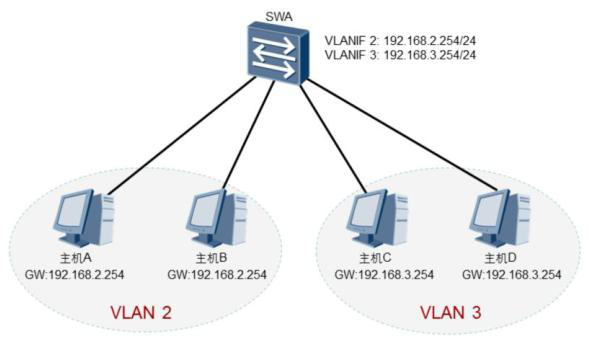

# 配置三层交换

 

三层交换机及多层交换机通过专用板卡设计，实现了比路由器更快的转发效率，所以在企业中得到大量应用，很多核心层设备都以及使用了多层交换机，包括在数据中心也基本是用其来做为核心交换。

 

通过三层交换机来解决VLAN间通信效率更好，解决了单臂路由方案的瓶颈问题。方法如下：在三层交换机上配置VLANIF接口来实现VLAN间路由。如果网络上有多个VLAN，则需要给每个VLAN配置一个VLANIF接口，并给每个VLANIF接口配置一个IP地址。用户设置的缺省网关就是三层交换机中VLANIF接口的IP地址。



## 三层交换机具体配置命令

1、需要先创建相应的VLAN，并且VLAN中还要有活跃接口。如果没有相应VLAN，VLANIF接口不会激活

 

2、创建VLANIF接口

 

```
[L3-SWB]interface Vlanif 2

[L3-SWB-Vlanif2]ip address 192.168.2.254 24

[L3-SWB]interface Vlanif 3 

[L3-SWB-Vlanif2]ip address 192.168.3.254 24
```

 

 

interface vlanif vlan-id命令用来创建VLANIF接口并进入到VLANIF接口视图。vlan-id表示与VLANIF接口相关联的VLAN编号。 VLANIF接口的IP地址作为主机的网关IP地址，和主机的IP地址必须位于同一网段。

 