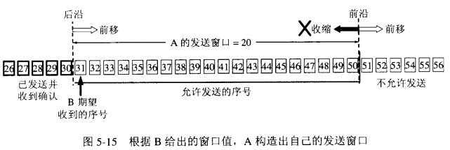
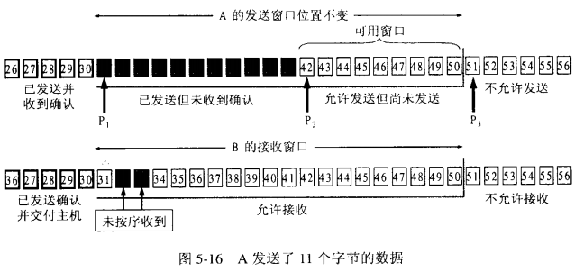

# TCP报头结构

## 认识TCP

传输层定义了主机应用程序之间端到端的连通性。传输层中最常见的两个协议分别是传输控制协TCP（Transmission Control Protocol）和用户数据包协议UDP（User Datagram Protocol）。

TCP位于TCP/IP模型的**传输层**，**它是一种面向连接的端到端协议**。TCP作为传输控制协议，可以为主机提供可靠的数据传输。两台主机在通信之前，需要TCP在它们之间建立可靠的传输通道。

TCP允许一个主机同时运行多个应用进程。**每台主机可以拥有多个应用端口，每对端口号、源和目标IP地址的组合唯一地标识了一个会话。端口分为知名端口和动态端口。**有些网络服务会使用固定的端口，这类端口称为知名端口，端口号范围为0-1023。如FTP、HTTP、Telnet、SNMP服务均使用知名端口。动态端口号范围从1024到65535，这些端口号一般不固定分配给某个服务，也就是说许多服务都可以使用这些端口。只要运行的程序向系统提出访问网络的申请，那么系统就可以从这些端口号中分配一个供该程序使用。

## TCP报头

TCP通常使用IP作为网络层协议，这时TCP数据段被封装在IP数据包内。TCP数据段由 TCP Header（头部）和TCP Data（数据）组成。TCP最多可以有60个字节的头部，如果没有Options字段，正常的长度是20字节。

### 1、**源端口号（Source Port）**

长度为16位，指明发送数据的进程。

### 2、**目的端口号（Destination Port）**

长度为16位，指明目的主机接收数据的进程。

### 3、**序号（Sequence Number）**

也称为序列号，长度为32位，序号用来标识从TCP发送端向接入端发送的数据字节流进行编号，可以理解成对字节流的计数。

### 4、**确认号（Acknowledgement Number）**

长度为32位，确认号包含发送确认的一端所期望收到的下一个序号。确认号只有在ACK标志为1时才有效。

### 5、**首部长度**

长度为4位，用于表示TCP报文首部的长度。用4位（bit）表示，十进制值就是[0,15]，一个TCP报文前20个字节是必有的，后40个字节根据情况可能有可能没有。如果TCP报文首部是20个字节，则该位应是20/4=5。

### 6、**保留位（Reserved）**

长度为6位，必须是0，它是为将来定义新用途保留的。

### 7、**标志（Code Bits）**

长度为6位，在TCP报文中不管是握手还是挥手还是传数据等，这6位标志都很重要。6位从左到右依次为：

- URG：紧急标志位，说明紧急指针有效；
- ACK：确认标志位，多数情况下空，说明确认序号有效；
- PSH：推标志位，置位时表示接收方应立即请求将报文交给应用层；
- RST：复位标志，用于重建一个已经混乱的连接；
- SYN：同步标志，该标志仅在三次握手建立TCP连接时有效
- FIN：结束标志，带该标志位的数据包用于结束一个TCP会话。

### 8、**窗口大小（Window Size）**

长度为16位，TCP流量控制由连接的每一端通过声明的窗口大小来提供。

### 9、**检验和（Checksum）**

长度为16位，该字段覆盖整个TCP报文端，是个强制性的字段，是由发送端计算和存储，到接收端后，由接收端进行验证。

### 10、**紧急指针（Urgent Pointer）**

长度为16位，指向数据中优先部分的最后一个字节，通知接收方紧急数据的长度，该字段在URG标志置位时有效。

### 11、**选项（Options）**

长度为0-40B（字节），必须以4B为单位变化，必要时可以填充0。通常包含：最长报文大小（MaximumSegment Size，MSS）、窗口扩大选项、时间戳选项、选择性确认（Selective ACKnowlegement，SACK）等。

### 12、**数据**

## TCP的可靠传输

TCP的可靠传输体现在TCP使用了确认技术来确保目的设备收到了从源设备发来的数据，并且是准确无误的。

确认技术的工作原理如下：

目的设备接收到源设备发送的数据段时，会向源端发送确认报文，源设备收到确认报文后，继续发送数据段，如此重复。如图所示，主机A向服务器A发送TCP数据段，为描述方便假定每个数据段的长度都是500个字节。当服务器A成功收到序列号是M+1499的字节以及之前的所有字节时，会以序列号M+1499+1=M+1500进行确认。另外，由于数据段N+3传输失败，所以服务器A未能收到序列号为M+1500的字节，因此服务器A还会再次以序列号M+1500进行确认。

## TCP流量控制

**TCP滑动窗口技术通过动态改变窗口大小来实现对端到端设备之间的数据传输进行流量控制。**

1. TCP协议的两端分别为发送者A和接收者B，由于是全双工协议，因此A和B应该分别维护着一个独立的发送缓冲区和接收缓冲区，由于对等性（A发B收和B发A收），我们以A发送B接收的情况作为例子；
2. 发送窗口是发送缓存中的一部分，是可以被TCP协议发送的那部分，其实应用层需要发送的所有数据都被放进了发送者的发送缓冲区；
3. 发送窗口中相关的有四个概念：已发送并收到确认的数据（不再发送窗口和发送缓冲区之内）、已发送但未收到确认的数据（位于发送窗口之中）、允许发送但尚未发送的数据以及发送窗口外发送缓冲区内暂时不允许发送的数据；
4. 每次成功发送数据之后，发送窗口就会在发送缓冲区中按顺序移动，将新的数据包含到窗口中准备发送；TCP建立连接的初始，B会告诉A自己的接收窗口大小，比如为‘20’；
   字节31-50为发送窗口

  A发送11个字节后，发送窗口位置不变，B接收到了乱序的数据分组：

  只有当A成功发送了数据，即发送的数据得到了B的确认之后，才会移动滑动窗口离开已发送的数据；同时B则确认连续的数据分组，对于乱序的分组则先接收下来，避免网络重复传递：

## TCP计时器

TCP中有四种计时器（Timer），分别为：

 

1、重传计时器：Retransmission Timer

 

2、坚持计时器：Persistent Timer

 

3、保活计时器：Keeplive Timer

 

4、时间等待计时器：Timer_Wait Timer

**计时器详解：**

1、重传计时器

 

TCP是保证数据可靠传输的？带确认的重传机制。在滑动窗口协议中，接受窗口会在连续收到的包序列中的最后一个包向发送端发送一个ACK，当网络拥堵的时候，发送端的数据包和接收端的ACK包都有可能丢失。TCP为了保证数据可靠传输，就规定在重传的“时间片”到了以后，如果还没有收到对方的ACK，就重发此包，以避免陷入无限等待中。当TCP发送报文段时，就创建该特定报文的重传计时器。可能发生两种情况：

 

若在计时器截止时间到之前收到了对此特定报文段的确认，则撤销此计时器。

 

若在收到了对此特定报文段的确认之前计时器截止时间到，则重传此报文段，并将计时器复位。

 

2、坚持计时器

 

先来考虑一下情景：发送端向接收端发送数据包，直到接受窗口填满了，然后接受窗口告诉发送方接受窗口填满了停止发送数据。此时的状态称为“零窗口”状态，发送端和接收端窗口大小均为0，直到接受方发送一个窗口非0的确认消息。但这个确认会丢失。我们知道TCP中，对确认是不需要发送确认的。若确认丢失了，接受TCP并不知道，而是会认为它已经完成了任务，并等待着发送TCP接着会发送更多的报文段。但发送TCP由于没有收到确认，就等待对方发送确认来通知窗口大小。双方的TCP都在永远的等待着对方。

 

要打开这种死锁，TCP为每一个链接使用一个坚持计时器。当发送TCP收到窗口大小为0的确认时，就坚持启动计时器。当坚持计时器期限到时，发送TCP就发送一个特殊的报文段，叫做探测报文。这个报文段只有一个字节的数据。他有一个序号，但他的序号永远不需要确认；甚至在计算机对其他部分的数据的确认时该序号也被忽略。探测报文段提醒接受TCP：确认已丢失，必须重传。

 

坚持计时器的值设置为重传时间的数值。但是，若没有收到从接收端来的响应，则需发送另一个探测报文段，并将坚持计时器的值加倍和复位。发送端继续发送探测报文段，将坚持计时器设定的值加倍和复位，直到这个值增大到门限值（通常是60秒）为止。在这以后，发送端每个60秒就发送一个探测报文，直到窗口重新打开。

 

3、保活计时器

 

保活计时器使用在某些实现中，用来防止在两个TCP之间的连接出现长时间的空闲。假定客户打开了到服务器的连接，传送了一些数据，然后就保持静默了。也许这个客户出故障了。在这种情况下，这个连接将永远的处理打开状态。

 

要解决这种问题，在大多数的实现中都是使服务器设置保活计时器。每当服务器收到客户的信息，就将计时器复位。通常设置为两小时。若服务器过了两小时还没有收到客户的信息，他就发送探测报文段。若发送了10个探测报文段还没有响应，就假定客户除了故障，因而就终止了该连接。这种连接的断开当然不会使用四次握手，而是直接硬性的中断和客户端的TCP连接。

 

4、时间等待计时器

时间等待及时器用于TCP“四次挥手”阶段。当客户端向服务器发送最后一次确认报文时，就设定一个时间等待及器，等待2MSL时间后再结束连接。 MSL：最长报文段寿命，大小为30s~2分钟。根据不同的应用有不同的设置。