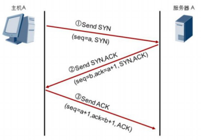
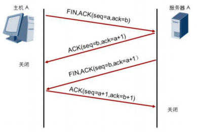

#  	TCP三次握手和四次断开

TCP有6个控制位：

**URG**(urgent紧急)：此标志表示**TCP包的紧急指针域**（后面马上就要说到）有效，用来**保 证 TCP 连 接 不 被 中 断** ， 并 且 督 促 中 间 层 设 备 要 尽 快 处 理 这 些 数 据 ； **ACK**(acknowledgement 确认) ：此标志表示应答域有效，就是说前面所说的TCP应答号将会包含在TCP数据包中；**有两个取值：0和1**，为1的时候表示应答域有效，反之为0；

**PSH**(push传送) ：这个标志位表示Push操作。所谓Push操作就是指在数据包**到达接收端以后**，**立即传送**给应用程序，而**不是**在**缓冲区中排队**；

**RST**(reset重置) ：这个标志表示**连接复位请求**。**用来复位那些产生错误的连接**，**也被用来拒绝错误和非法的数据包；**

**SYN**(synchronous建立联机) ：表示同步序号**，用来建立连接**。SYN标志位和ACK标志位搭配使用，当连接请求的时候，SYN=1，ACK=0；连接被相应的时候，SYN=1， ACK=1；

**FIN**(finish结束) ：表示**发送端已经达到数据末尾**，也就是说双方的**数据传送完成**，没有数据可以传送了，**发送FIN标志位的TCP数据包后，连接将被断开。**

## 三次握手

**TCP在传输数据前，需要先建立连接，这个过程为3次握手过程：**

 

**TCP**是一种**可靠的**，**面向连接**的**全双工**传输层协议。**TCP**连接的**建立**是一个**三次握手**的过程。如图所示：

**\1**. 主机A（通常也称为客户端）发送一个标识了**SYN**的数据段，表示**期望**与服务器A**建立连接**，此数据段的序列号（**seq**）为**a**。

**\2**. 服务器A回复标识了**SYN+ACK**的数据段，此数据段的序列号（**seq**）为**b，**确认序列号为主机A的序列号加**1（a+1）**，以此作为对主机A的**SYN报文的确认**。

**\3.** 主机A发送一个标识了**ACK**的数据段，此数据段的序列号（seq）为a+1，确认序列号为服务器A的序列号加**1（b+1**），以此作为对服务器A的**SYN报文的确认**。

**TCP支持全双工模式传输数据**，这意味着**同一时刻两个方向都可以进行数据的传输**。在传输数据之前，TCP通过三次握手建立的实际上是两个方向的连接，因此在传输完毕后，两个方向的连接必须都关闭。

## 四次挥手

**TCP连接的建立是一个三次握手的过程，而TCP连接的终止则要经过四次握手。**

如图所示：

\1. 主机A**想终止连接**，于是**发送**一个标识了**FIN，ACK**的数据段，**序列号为a，确认序列号为b**。

\2. 服务器A**回应**一个标识了**ACK**的数据段，**序列号为b，确认序号为a+1**，作为对主机A的**FIN报文的确认**。

\3. 服务器A**想终止连接**，于是向主机A发送一个标识了**FIN，ACK**的数据段**，序列号为b，确认序列号为a+1。**

\4. 主机A**回应**一个标识了**ACK**的数据段，**序列号为a+1，确认序号为b+1，作为对服务器A 的FIN报文的确认。**

**以上四次交互便完成了两个方向连接的关闭。**

 

# **课后练习题：**

1、描述TCP三次握手过程

2、在TCP4次断开过程中，如果担心最后客户端发送的ACK报文丢失，TCP如何来解决这个问题？