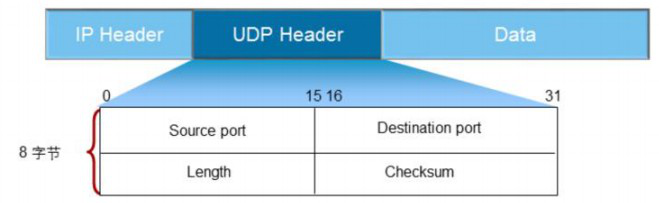
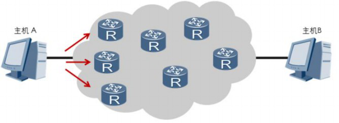
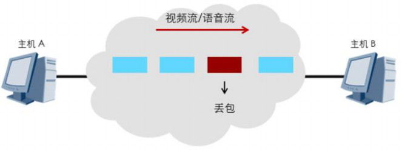

## UDP报头结构

### 概述

​	当应用程序对传输的可靠性要求不高，但是对传输速度和延迟要求较高时，可以用UDP协议来替代TCP协议在传输层控制数据的转发。UDP将数据从源端发送到目的端时，  无需事先建立连接。	UDP采用了简单、易操作的机制在应用程序间传输数据，没有使用TCP 中的确认技术或滑动窗口机制，因此UDP不能保证数据传输的可靠性，也无法避免接收到 重复数据的情况。

​	UDP是一种无面向连接的传输层协议，不能保证传输可靠性。

​	UDP报文分为UDP报文头和UDP数据区域两部分。报头由源端口、目的端口、报文长度以及校验和组成。UDP适合于实时数据传输，如语音和视频通信。相比于TCP，UDP的传输效率更高、开销更小，但是无法保障数据传输的可靠性。UDP头部的标识如下：

1. 16位源端口号：源主机的应用程序使用的端口号。

2. 16位目的端口号：目的主机的应用程序使用的端口号。

3. 16位UDP长度：是指UDP头部和UDP数据的字节长度。因为UDP头部长度为8字节，所以该字段的最小值为8。

4. 16位UDP校验和：该字段提供了与TCP校验字段同样的功能；该字段是可选的。

​	

​	主机A发送数据包时，这些数据包是以有序的方式发送到网络中的，每个数据包独立地在网络中被发送，所以不同的数据包可能会通过不同的网络路径到达主机B。这样的情况  下，先发送的数据包不一定先到达主机B。因为UDP数据包没有序号，主机B将无法通过UDP协议将数据包按照原来的顺序重新组合，所以此时需要应用程序提供报文的到达确  认、排序和流量控制等功能。通常情况下，UDP采用实时传输机制和时间戳来传输语音和视频数据。

​	UDP不提供重传机制，占用资源少，处理效率高。

### UDP适用情况

​	UDP适合传输对时延敏感的流量，如语音和视频。在使用TCP协议传输数据时，如果一个数据段丢失或者接收端对某个数据段没有确认，发送端会重新发送该数据段。

​	TCP重新发送数据会带来传输延迟和重复数据，降低了用户的体验。对于时延敏感的应用，少量的数据丢失一般可以被忽略，这时使用UDP传输将能够提升用户的体验。

