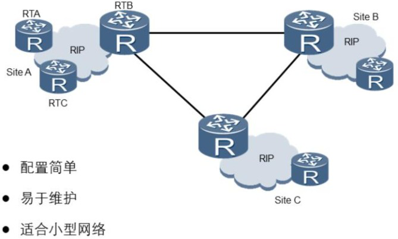
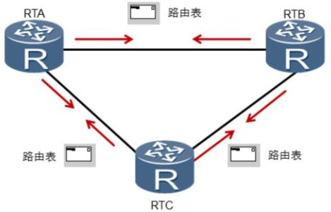
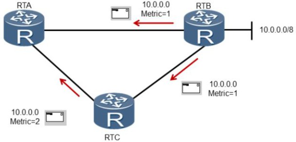

# **RIP原理**

**RIP是一种比较简单的内部网关协议**。 RIP使用了基于**距离矢量的贝尔曼-福特算法**（ Bellman-Ford） 来计算到达目的网络的**最佳路径**。最初的RIP协议开发时间较早， **所以在带宽、 配置和管理方面要求也较低**， 因此， RIP主要**适合于规模较小的网络中。**

路由器启动时， **路由表中只会包含直连路由**。 **运行RIP**之后， 路由器会**发送Request 报文**， 用来**请求邻居路由器的RIP路由**。 运行RIP的邻居路由器**收到**该Request报文**后**， **会根据自己的路由表， 生成Response报文进行回复。** 路由器在收到Response报文后， 会将相应的路由**添加到自己的路由表中**。

**RIP网络稳定以后**， 每个路由器会**周期性**地向邻居路由器**通告**自己的整张**路由表中的路由信息， 默认周期为30秒**。 邻居路由器**根据收到的路由信息刷新自己的路由表。**

**RIP使用跳数作为度量值来衡量到达目的网络的距离。** **在RIP中， 路由器到与它直接相连网络的跳数为0， 每经过**一个路由器后跳**数加1**。 为限制收敛时间， RIP规定跳数的取值**范围为0~15**之间的整数， **大于15**的跳数被定义为无穷大， 即目的网络或主机**不可达**。

**路由器从某一邻居路由器收到路由更新报文时， 将根据以下原则更新本路由器的RIP 路由表**：

**\1.** 对于本路由表中已有的路由项， 当该路由项的下一跳是该邻居路由器时， 不论度量值将增大或是减少， 都更新该路由项（ 度量值相同时只将其老化定时器清零。 路由表中的每一路由项都对应了一个老化定时器， 当路由项在 180 秒内没有任何更新时， 定时器超时， 该路由项的度量值变为不可达） 。

**\2**. 当该路由项的下一跳不是该邻居路由器时， 如果度量值将减少， 则更新该路由项。

**\3**. 对于本路由表中不存在的路由项， 如果度量值小于16， 则在路由表中增加该路由项。

某路由项的度量值变为不可达后， 该路由会在 Response 报文中发布四次（ 120 秒）， 然后从路由表中清除。

RIP包括RIPv1和RIPv2两个版本。RIPv1为有类别路由协议， 不支持VLSM和CIDR。RIPv2为无类别路由协议， 支持VLSM， 支持路由聚合与CIDR。RIPv1使用广播发送报文； RIPv2有两种发送方式：广播方式和组播方式， 缺省是组播方式。 RIPv2的组播地址为224.0.0.9。 组播发送报文的好处是在同一网络中那些没有运行RIP的设备可以避免接收RIP 的广播报文；另外， 组播发送报文还可以使运行RIPv1的设备避免错误地接收和处理RIPv2 中带有子网掩码的路由。RIPv1不支持认证功能，RIPv2支持明文认证和MD5密文认证。

 

# **课后习题：**

1、描述RIP工作过程

2、RIPv1和v2版本有哪些区别？

 