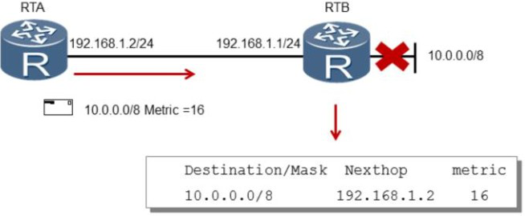

## RIP环路避免机制

​	由于RIP是距离矢量路由协议，路由条目是由邻居路由器学习到的，所以当网络出现故障时，可能出现路由环路。

​	为了避免路由环路，所以制定了很多机制：

### 1. 水平分割机制

​	水平分割的原理是， 路由器从某个接口学习到的路由， 不会再从该接口发出去。

### 2、设置最大跳数，规定最大跳数为15跳。

### 3、毒性反转。

​	毒性反转是指路由器从某个接口学习到路由之后，发回给邻居路由器时会将该路由的跳数设置为16，毒性反转机制的实现可以使错误路由立即超时。

​	毒性反转和水平分割不可同时使用，如果同时使用，将只有毒性反转起作用。默认开启的是水平分割机制。

### 4、触发更新

​	缺省情况下， 一台RIP路由器每30秒会发送一次路由表更新给邻居路由器。当本地路由信息发生变化时， 触发更新功能允许路由器立即发送触发更新报文给邻居路由器， 来通知路由信息更新， 而不需要等待更新定时器超时， 从而加速了网络收敛。