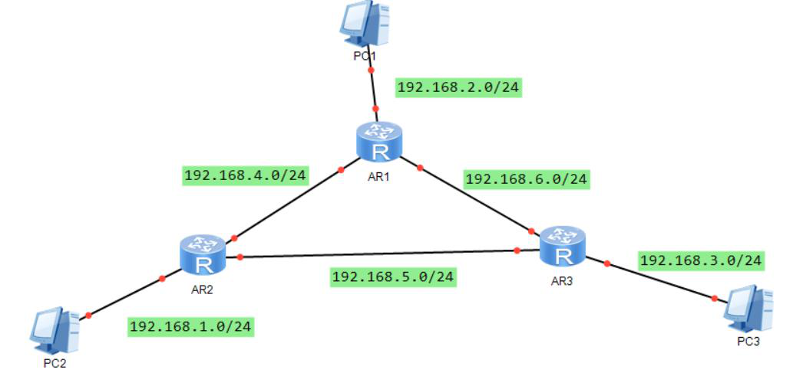

# 配置RIP--作业

## 基础练习

1. RIP的路由跳数是在什么时候增加的呢？

   

2. 抑制端口有哪些作用？

   

## 进阶练习

1. 实验拓扑

   

   要求：

    

   1）使用RIPv2路由协议配置实现全网互通

   2）将所有路由器连接主机的端口配置为抑制接口

   3）在AR1上，将其连接AR2和AR3的端口上关闭水平分割，然后抓包查看其发出的RIP报文和没有关闭水平分割前的RIP报文有何不同

   4）提交路由器上的关键配置

​	