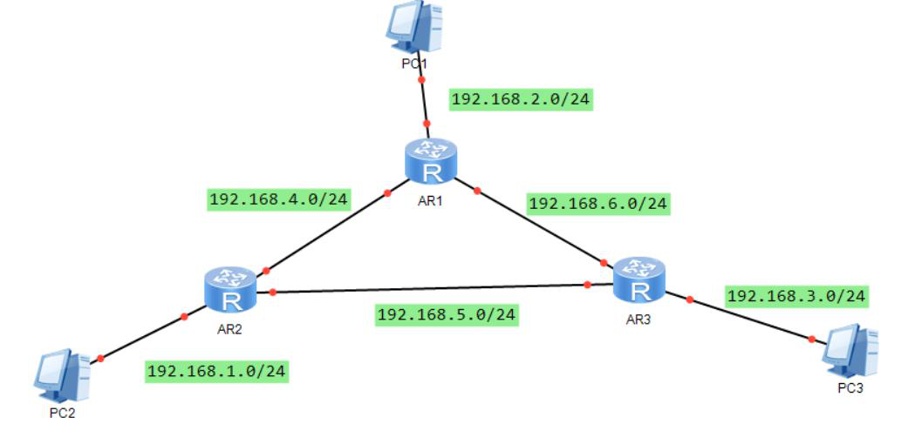

# 配置RIP--答案

## 基础练习

1. RIP的路由跳数是在什么时候增加的呢？

   每经过一个路由器

2. 抑制端口有哪些作用？

   使其只接收RIP报文，更新自己的路由表，但不发送RIP报文。

   在NBMA网络上，一些路由器需要接收RIP更新消息但是不需要广播或者组播路由器自身的路由更新，而是通过命令peer <ip address>与对端路由器建立关系。

## 进阶练习

1. 实验拓扑

   

   要求：

    

   1）使用RIPv2路由协议配置实现全网互通

   2）将所有路由器连接主机的端口配置为抑制接口

   3）在AR1上，将其连接AR2和AR3的端口上关闭水平分割，然后抓包查看其发出的RIP报文和没有关闭水平分割前的RIP报文有何不同

   4）提交路由器上的关键配置


​	

```
关键配置：
//宣告网络
[AR1]rip
[AR1-rip-1]network 192.168.1.0
[AR1-rip-1]network 192.168.2.0
[AR1-rip-1]version 2
//配置抑制接口
[AR1-rip-1]silent-interface GigabitEthernet 0/0/0 silent-interface
//关闭水平分割
[AR1-GigabitEthernet0/0/0]undo rip split-horizon 

```

