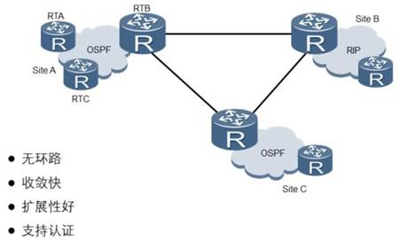
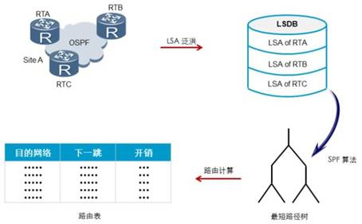

# OSPF基础原理

OSPF是一种基于链路状态的路由协议， 它从设计上就保证了无路由环路。 OSPF支持区域的划分， 区域内部的路由器使用SPF最短路径算法保证了区域内部的无环路。 OSPF还利用区域间的连接规则保证了区域之间无路由环路。

OSPF支持触发更新， 能够快速检测并通告自治系统内的拓扑变化。

OSPF可以解决网络扩容带来的问题。 当网络上路由器越来越多， 路由信息流量急剧增长的时候， OSPF可以将每个自治系统划分为多个区域，并限制每个区域的范围。 OSPF 这种分区域的特点， 使得OSPF特别适用于大中型网络。 OSPF可以提供认证功能。 OSPF 路由器之间的报文可以配置成必须经过认证才能进行交换。

OSPF要求每台运行OSPF的路由器都了解整个网络的链路状态信息，这样才能计算出到达目的地的最优路径。 OSPF的收敛过程由链路状态公告LSA（Link State Advertisement） 泛洪开始， LSA中包含了路由器已知的接口IP地址、 掩码、 开销和网络类型等信息。 收到LSA的路由器都可以根据LSA提供的信息建立自己的链路状态数据库

LSDB（ Link State Database） ， 并在LSDB的基础上使用SPF算法进行运算， 建立起到达每个网络的最短路径树。 最后， 通过最短路径树得出到达目的网络的最优路由， 并将其加入到IP路由表中。

## OSPF工作步骤

1、 建立邻居

2、 互相交换LSA,形成统一的LSDB

3、 通过SPF算法计算出最短路径树

4、 选择最优路径，生成路由表

OSPF直接运行在IP协议之上， 使用IP协议号89。

## OSPF有五种报文类型

OSPF有五种报文类型， 每种报文都使用相同的OSPF报文头。

1. Hello报文：最常用的一种报文， 用于发现、 维护邻居关系。 并在广播和NBMA（None-Broadcast Multi-Access） 类型的网络中选举指定 路 由 器 DR （ Designated Router ） 和 备 份 指 定 路 由 器 BDR（Backup Designated Router） 。

2. DD报文：两台路由器进行LSDB数据库同步时， 用DD报文来描述自己的LSDB。 DD报文的内容包括LSDB中每一条LSA的头部（LSA的头部可以唯一标识一条LSA） 。 LSA 头部只占一条LSA的整个数据量的一小部分， 所以， 这样就可以减少路由器之间的协议报文流量。

3. LSR报文：两台路由器互相交换过DD报文之后， 知道对端的路由器有哪些LSA是本地LSDB所缺少的， 这时需要发送LSR报文向对方请求缺少的LSA， LSR只包含了所需要的LSA的摘要信息。

4. LSU报文：用来向对端路由器发送所需要的LSA。

5. LSACK报文： 用来对接收到的LSU报文进行确认。

