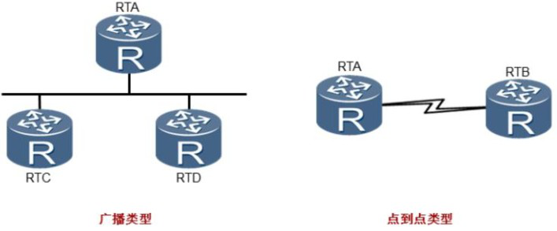
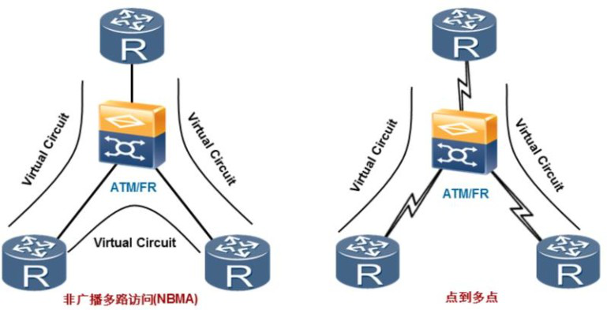
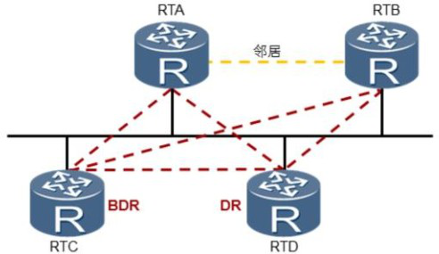
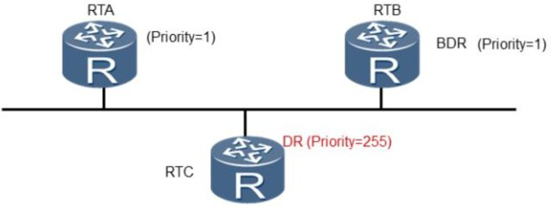
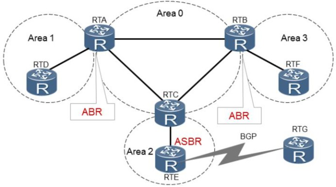
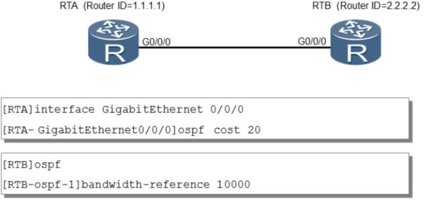

## OSPF网络类型及区域

​	OSPF定义了四种网络类型， 分别是点到点网络， 广播型网络， NBMA网络和点到多点网络。

### 点到点网络， 广播型网络

+ 点到点网络是指只把两台路由器直接相连的网络。 一个运行PPP的64K串行线路就是一个点到点网络的例子。

+ 广播型网络是指支持两台以上路由器， 并且具有广播能力的网络。 一个含有三台路由器的以太网就是一个广播型网络的例子。



```markdown
**附录：**
## hub spoke

​	轴心方式拓扑

​	Hub点就是汇聚Spoke节点的中心节点，而Spoke节点就是分支节点。

## 帧中继

​	帧中继是一种有效的数据传输技术，可以作为建立高性能的虚拟广域连接的一种途径。帧中继正逐渐被ATM、IP等协议（包括IP虚拟专用网）替代。

## 异步传输模式

​	ATM是一种传输模式，在这一模式中，信息被组织成信元，因包含来自某用户信息的各个信元不需要周期性出现，这种传输模式是异步的。

​	ATM交换机是用于ATM网络的交换机产品。但由于ATM网络独特的技术特性，现在还只广泛用于电信、邮政网的主干网段。相对于物美价廉的以太网交换机而言，ATM交换机的价格实是很高的，所以也就在普通局域网中见不到它的踪迹。

ATM交换机技术，主要广泛用于电信、邮政网的主干网段，因此其交换机产品在市场上很少看到。如我们在下面将要讲的ADSL宽带接入方式中如果采用PPPoA协议的话，在局端（NSP端）（提供终端接入的一方，网络服务提供商）就需要配置ATM交换机，有线电视的Cable Modem互联网接入法在局端也采用ATM交换机。它的传输介质一般采用光纤，接口类型同样一般有两种：以太网RJ－45接口和光纤接口，这两种接口适合与不同类型的网络互联。

## PVC和SVC

​	永久虚电路 (PVC) 和交换虚电路 (SVC) 
```


### NBMA网络、点到多点网络

​	OSPF可以在不支持广播的多路访问网络上运行，此类网络包括在hub spoke拓扑上运行的帧中继（FR）和异步传输模式（ATM） 网络， 这些网络的通信依赖于虚电路。 OSPF 定义了两种支持多路访问的网络类型：非广播多路访问网络（ NBMA） 和点到多点网络（ Point To MultiPoints） 。

+  NBMA:在NBMA网络上， OSPF模拟在广播型网络上的操作， 但是每个路由器的邻居需要手动配置。 NBMA方式要求网络中的路由器组成全连接。
+ P2MP:将整个网络看成是一组点到点网络。 对于不能组成全连接的网络应当使用点到多点方式， 例如只使用PVC的不完全连接的帧中继网络。




### DR和BDR 

​	每一个含有至少两个路由器的广播型网络和NBMA网络都有一个DR和BDR。DR和BDR 可以减少邻接关系的数量， 从而减少链路状态信息以及路由信息的交换次数， 这样可以节省带宽， 降低对路由器处理能力的压力。

​	一个既不是DR也不是BDR的路由器只与DR和BDR形成邻接关系并交换链路状态信息以及路由信息， 这样就大大减少了大型广播型网络和NBMA网络中的邻接关系数量。  在没有DR的广播网络上，  邻接关系的数量可以根据公式n(n-1)/2计算出， n代表参与OSPF的路由器接口的数量。（ **n(n-1)/2 n代表参与OSPF路由器的数量** ）

#### 	例：

​	 所有路由器之间有6个邻接关系。 当指定了DR后， 所有的路由器都与DR建立起邻接关系， DR成为该广播网络上的中心点。BDR在DR发生故障时接管业务， 一个广播网络上所有路由器都必须同BDR 建立邻接关系。 

​	  本例中使用DR和BDR将邻接关系从6减少到了5，RTA和RTB都只需要同DR和BDR建立邻接关系， RTA和RTB之间建立的是邻居关系。此例中， 邻接关系数量的减少效果并不明显。 但是， 当网络上部署了大量路由器时， 比如100台， 那么情况就大不一样了。




### DR选举

​	在邻居发现完成之后， 路由器会根据网段类型进行DR选举。 在广播和NBMA网络上， 路由器会根据参与选举的每个接口的优先级进行DR选举。优先级取值范围为0-255， 值越高越优先。 缺省情况下， 接口优先级为1。

​	如果一个接口优先级为0， 那么该接口将不会参与DR或者BDR的选举。如果优先级相同时， 则比较Router ID， 值越大越优先被选举为DR。为了给DR做备份，  每个广播和NBMA网络上还要选举一个BDR。  

​	BDR也会与网络上所有的路由器建立邻接关系。为了维护网络上邻接关系的稳定性， 如果网络中已经存在DR和BDR，则新添加进该网络的路由器不会成为DR和BDR， 不管该路由器的Router Priority是否最大。

​	 如果当前DR发生故障， 则当前BDR自动成为新的DR， 网络中重新选举BDR；如果当前BDR发生故障， 则DR不变，重新选举BDR。 这种选举机制的目的是为了保持邻接关系的稳定， 使拓扑结构的改变对邻接关系的影响尽量小。




### 划分OSPF区域

​	OSPF支持将一组网段组合在一起， 这样的一个组合称为一个区域。

​	划分OSPF区域可以缩小路由器的LSDB规模， 减少网络流量。区域内的详细拓扑信息不向其他区域发送， 区域间传递的是抽象的路由信息， 而不是详细的描述拓扑结构的链路状态信息。 每个区域都有自己的LSDB， 不同区域的LSDB是不同的。 路由器会为每一个自己所连接到的区域维护一个单独的LSDB。 由于详细链路状态信息不会被发布到区域以外， 因此LSDB的规模大大缩小了。

​	见下图，Area 0为骨干区域， 为了避免区域间路由环路， 非骨干区域之间不允许直接相互发布路由信息。 因此， 每个区域都必须连接到骨干区域。运行在区域之间的路由器叫做区域边界路由器ABR（Area Boundary Router） ， 它包含所有相连区域的LSDB。 自治系统边界路由器ASBR（Autonomous System Boundary Router） 是指和其他AS中的路由器交换路由信息的路由器， 这种路由器会向整个AS通告AS外部路由信息。

​	在规模较小的企业网络中， 可以把所有的路由器划分到同一个区域中，同一个OSPF区域中的路由器中的LSDB是完全一致的。 OSPF区域号可以手动配置， 为了便于将来的网络扩展， 推荐将该区域号设置为0， 即骨干区域。




### 链路开销计算

​	OSPF基于接口带宽计算开销， 计算公式为：接口开销=带宽参考值÷带宽。 带宽参考值可配置， 缺省为100Mbit/s。 以此， 一个64kbit/s串口的开销为1562， 一个E1接口（2.048 Mbit/s） 的开销为48。

​	命令bandwidth-reference可以用来调整带宽参考值， 从而可以改变接口开销， 带宽参考值越大， 开销越准确。 在支持10Gbit/s速率的情况下，推荐将带宽参考值提高到10000Mbit/s来分别为10 Gbit/s、 1 Gbit/s和100Mbit/s的链路提供1、 10和100的开销。 注意， 配置带宽参考值时，需要在整个OSPF网络中统一进行调整。另外， 还可以通过ospf cost命令来手动为一个接口调整开销， 开销值范围是1~65535， 缺省值为1。



```markdown
附录：
	OSPF的度量值为cost（链路开销）它是根据链路带宽算出来的。基本上是和链路带宽成反比。也就是说带宽越大，开销值越小，链路越优。计算公式为：接口开销=参考带宽/逻辑带宽 （逻辑带宽通常配置和物理接口带宽相同）
	OSPF先将链路每段的开销分别计算，然后计算从当前节点到达任意目标地址的网络开销，即多段链路累加。选出到达目标网络开销最小的路径，为最佳路径。
	ospf接口开销有默认的参考值，即接口带宽默认为100Mbps，如果实际带宽值为10M，那么该接口的cost=100/10=10,如果该接口实际带宽为100Mpbs那么接口开销为cost=100/100=1 。但现在的网络已经进入1000M时代，就会出现100M和和1000M的带宽在ospf中得到的开销相同都是1。所以如果实际应用中如果接口带宽值较高时应该重新配置端口的参考带宽值。
```

