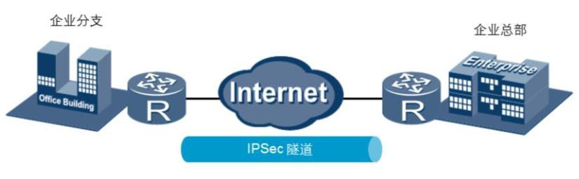

# VPN技术简介

虚拟专用网络(VPN)的功能是：**在公用网络上建立专用网络，进行加密通讯。**在企业网络中有广泛应用。VPN网关通过对数据包的加密和数据包目标地址的转换实现远程访问。VPN有多种分类方式，主要是按协议进行分类。VPN可通过服务器、硬件、软件等多种方式实现。

## VPN的分类

1、二层VPN：包括点到点隧道协议（PPTP）、第二层转发协议（L2F），第二层隧道协议（L2TP）、多协议标记交换（MPLS）等；

2、三层VPN：包括通用路由封装协议（GRE）、IP安全（IPSec），这是目前最流行的两种三层协议；

3、应用层VPN：包括安全套接层（SSL）和传输层安全（TLS）,准确来说工作在传输层和应用层之间。

## VPN实现主要设计到的技术.

**1、隧道技术：**

是VPN的核心技术，VPN的所有实现都是依赖于隧道。隧道主要利用协议的封装来实现的。即用一种网络协议来封装另一种网络协议的报文。

 

2、加密技术：

信息加密体制包括对称加密体制和非对称加密体制，实际应用中通常是融合二者的混合加密技术。非对称加密技术（公开秘钥）多用于认证、数字签名以及安全传输会话秘钥等场合，对称加密技术则用于大量传输数据的加密和完整性保护。

 

**3、秘钥管理技术**

现行秘钥管理技术分为SKIP和ISAKMP/OAKLEY两种。SKIP主要利用Diffie-Hellman算法在开放网络上安全传输秘钥；而ISAKMP则采用公开秘钥机制，通信实体双方均有两把秘钥，分别为公钥、私钥，不同的VPN实现技术选用其一或者兼而有之。

 

**4、身份认证技术**

认证协议一般都要采用基于散列函数的消息摘要技术，因而还可以提供消息完整性验证。从实现技术来看，目前VPN采用的身份认证技术主要分为非PKI体系和PKI体系两类。

- PKI是Public Key Infrastructure的首字母缩写。PKI技术是公钥基础设施的简称，这种技术的主要原理是遵循既定标准的密钥管理平台，能够为互联网的应用提供加密服务以及数字签名服务。简单来说，PKI技术就是一种基础设施，主要是利用公钥理论和技术来提供一切安全服务。这种技术是目前网络安全建设的核心和关键，也是为电子商务发展提供保障的基础。

## IPSec

**IPSec（Internet Protocol Security）是IETF定义的一个协议组。通信双方在IP层通过加密、完整性校验、数据源认证等方式，保证了IP数据报文在网络上传输的机密性、完整性和防重放。**

- **IETF**：国际互联网工程任务组（The Internet Engineering Task Force）

1、机密性（Confidentiality）指对数据进行加密保护，用密文的形式传送数据。

 

2、完整性（Data integrity）指对接收的数据进行认证，以判定报文是否被篡改。

3、防重放（Anti-replay）指防止恶意用户通过重复发送捕获到的数据包所进行的攻击，即接收方会拒绝旧的或重复的数据包。

企业远程分支机构可以通过使用IPSec VPN建立安全传输通道，接入到企业总部网络。

****