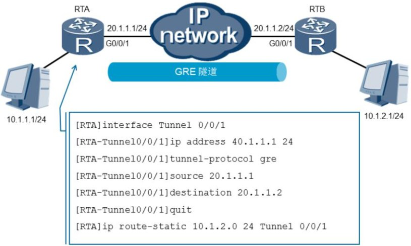

## 实现GRE隧道

​	可以在路由器、硬件防护墙或者Linux主机上实现GRE协议，配置方式虽然不同，但是只要理解了协议原理，其实都差不多，只是配置命令不同而已。



​	注意：在配置GRE隧道之前，一定要保证隧道两端能够互通，即隧道的源地址和目的地址是可以通信的。

### 配置过程：

#### 	1、创建并启动隧道接口：

```shell
interface Tunnel0/0/1
ip address 10.1.1.1 255.255.255.0 tunnel-protocol gre
source 100.1.1.2
destination 200.1.1.2
```

+ interface tunnel interface-number命令用来创建Tunnel接口。 创建Tunnel接口后，需要配置Tunnel接口的IP地址和Tunnel接口的封装协议。

+ tunnel-protocol命令用来配置Tunnel接口的隧道协议
+ source { source-ip-address | interface-type interface-number }命令用来配置Tunnel源地址或源接口。
+ destination dest-ip-address命令用来指定Tunnel接口的目的IP地址。

#### 2、验证隧道接口状态

```shell
[BeiJing]display interface Tunnel 0/0/1 Tunnel0/0/1


current state : UP
Line protocol current state : UP
Last line protocol up time : 2019-05-15 16:26:56 UTC-08:00

Description:HUAWEI, AR Series, Tunnel0/0/1 Interface Route Port,The Maximum Transmit Unit is 1500 Internet Address is 10.1.1.1/24
Encapsulation is TUNNEL, loopback not set
Tunnel source 100.1.1.2 (GigabitEthernet0/0/0), destination 200.1.1.2 Tunnel protocol/transport GRE/IP, key disabled
keepalive disabled
Checksumming of packets disabled
Current system time: 2019-05-15 16:30:46-08:00
300 seconds input rate 0 bits/sec, 0 packets/sec
300 seconds output rate 0 bits/sec, 0 packets/sec
0 seconds input rate 0 bits/sec, 0 packets/sec
0 seconds output rate 0 bits/sec, 0 packets/sec
0 packets input, 0 bytes
0 input error
5 packets output, 540 bytes
0 output error
Input bandwidth utilization : -- Output bandwidth utilization : --


	也可以ping一下对端设备的隧道接口,查看是否可以通信。如果可以ping通，说明隧道建立成功
```


#### 3、配置到达对端设备后面网络的路由条目。

​	可以使用静态路由，也可以使用动态路由。下一跳为对端设备的隧道接口IP地址，或者设置出接口为本地隧道接口也可以。

```shell
[BeiJing]ip route-static 172.16.1.0 24 Tunnel 0/0/1 
```

#### 4、配置Keepalive检测

```shell
interface Tunnel0/0/1 keepalive period 6
```

