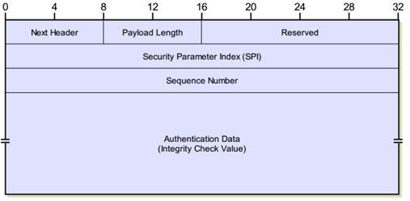
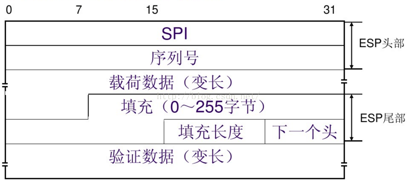

# IPSec封装协议

GRE是一个独立的协议，但是IPSec不是一个具体协议，它其实是一套协议的统称。

IPSec VPN 体 系 结 构 主 要 由 AH （ Authentication Header ） 、 ESP（Encapsulating Security Payload） 和IKE（Internet Key Exchange）协议套件组成。

**IPSec：Internet Protocol Security： 互联网安全协议。**

# IPSec的封装协议主要是：AH和ESP

AH：认证头协议。可对整个数据包（IP 报头与数据包中的数据负载）提供身份验证、完整性与防重放保护。但是它不提供保密性，即它不对数据进行加密。数据可以读取，但是禁止修改。AH 使用加密哈希算法签名数据包以求得完整性。AH 可以独立使用，也可以与ESP协议组合使用，不能穿越NAT设备

AH的协议号为51号，AH报头结构如下图：

1. Next Header ： AH header的下一个头部的协议号，这个字段定义了被封装的数据的协议

2. Payload Length：AH header的长度。只定义了AH头长度，不包括外面的IP头和数据长度

3. Reserverd： 保留部分

4. SPI : 安全的参数索引，使用了一个数值独立的识别到达远端对等体的连接，目的地址和安全协议类型的组合，用于识别对这个包进行验证的安全联盟SA

5. Sequence Number(序列号):  为该数据包提供防重放保护。序数是32位、递增的数字（从 1 开始），它表示通过通信的安全关联所发送的数据包数。在快速模式安全关联的生存期内序列号不能重复。接收方将检查该字段，以确认使用该数字的安全关联数据包还没有被接收过。如果一个已经被接收，则数据包被拒绝。

6. Authentication Data(验证数据): 是一个长度可变的域，长度为32比特的整数倍。具体格式因认证算法而异 。该认证数据也被称为数据报的完整性校验值（ICV）。就是哈希验证的值。将完整的IP数据包中所有的字段取出加上一个共享的密钥得出。主要的部分：IP数据包头、不包括易变的字段、AH的头、不包括ICV的字段和用户数据。

ESP：封装安全负载（Encapsulating Security Payload）是IPsec体系结构中的一种主要协议，其主要设计来在 IPv4 和 IPv6 中提供安全服务的混合应用。IPsec ESP 通过加密需要保护的数据以及在 IPsec ESP 的数据部分放置这些加密的数据来提供机密性和完整性。且ESP加密采用的是对称密钥加密算法，能够提供无连接的数据完整性验证、数据来源验证和防重放攻击服务。根据用户安全要求，这个机制既可以用于加密一个传输层的段（如：TCP、UDP、ICMP、IGMP），也可以用于加密一整个的 IP 数据报。

ESP的协议号为50，可以单独使用，也可以与AH一起使用，可以穿越NAT设备。如果穿越PAT设备，需要使用NAT-T技术。

ESP的报文结构如下：

1. ESP Header ： 主要是包括SPI和Seq number，放在加密数据之前,同AH里面作用是一样的加密数据是由原始数据+ESP尾部信息+共享密钥计算得到

3. ESP Trailer：被放置在加密数据之后，包括一个填充区域和填充长度以及一个Next Header， 这个地方比较特殊，ESP header中没有Next Header放在Trailer中。

4. ESP Authentication Data ： 必须是32bit的整数倍，是在前面个字段基础上计算的出来的完整性校验值ICV。包括：ESP头部、加密数据、密钥信息

