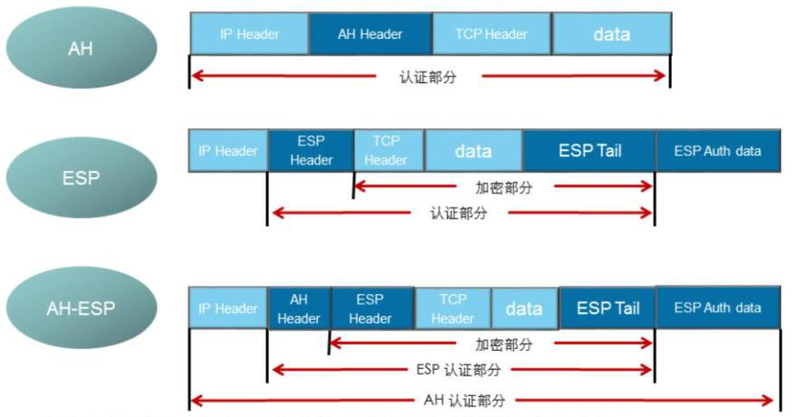
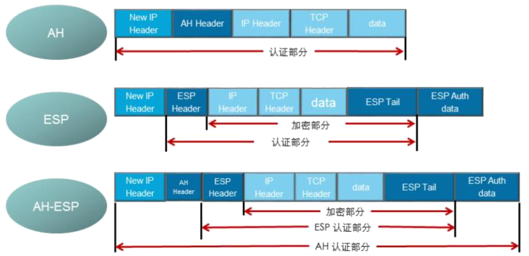

# IPSec封装模式

大家已经了解了GRE协议，可以看到GRE是对原始数据整个的保护，IPSec协议和GRE一样都属于三层的VPN技术，其可以根据使用情况对原始数据进行不同的保护方式。

 

IPSec协议有两种封装模式：**传输模式和隧道模式。**

## 传输模式

传输模式中，在IP报文头和高层协议之间插入AH或ESP头。传输模式中的AH或ESP主要对上层协议数据提供保护。

 

传输模式中的AH：在IP头部之后插入AH头，对整个IP数据包进行完整性校验。

 

传输模式中的ESP：在IP头部之后插入ESP头，在数据字段后插入尾部以及认证字段。对高层数据和ESP尾部进行加密，对IP数据包中的ESP报文头，高层数据和ESP尾部进行完整性校验。

 

传输模式中的AH+ESP：在IP头部之后插入AH和ESP头，在数据字段后插入尾部以及认证字段。

## 隧道模式

隧道模式中， AH或ESP头封装在原始IP报文头之前，并另外生成一个新的IP头封装到AH或ESP之前。隧道模式可以完全地对原始IP数据报进行认证和加密，而且，可以使用IPSec对等体的IP地址来隐藏客户机的IP地址。

 

隧道模式中的AH：对整个原始IP报文提供完整性检查和认证，认证功能优于ESP。但AH不提供加密功能，所以通常和ESP联合使用。

 

隧道模式中的ESP：对整个原始IP报文和ESP尾部进行加密，对ESP报文头、原始IP报文和ESP尾部进行完整性校验。

 

隧道模式中的AH+ESP：对整个原始IP报文和ESP尾部进行加密， AH、ESP分别会对不同部分进行完整性校验。

在站点到站点的VPN中，一般都是采用隧道模式进行封装，在GRE+IPSec解决方案中，一般会采用隧道模式封装。

 

**总结：加密点和通信点相同，采用传输模式；加密点和通信点不同，采用隧道模式**

## 传输模式和隧道模式对比

1. 传输模式：加密点与通信点完全一致，没有新的包头 隧道模式：加密点与通信点不一致，增加新的包头。

2. 传输模式主要用于end to end（端到端）的应用场景。
3. 隧道模式主要用于site to site（站到站）的应用场景。
4. 大部分情况用隧道模式。