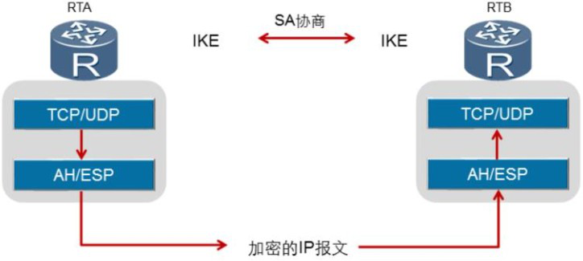
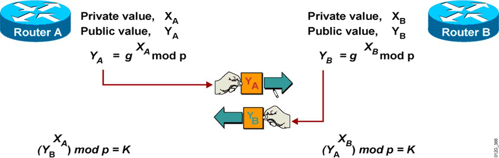

## IPSec体系架构

### IPSec VPN 体 系

​	IPSec不是一个单独的协议，IPSec VPN 体 系 结 构 主 要 由 AH （ Authentication Header ） 、 ESP（Encapsulating Security Payload） 和 IKE（Internet Key Exchange）协议套件组成。通过AH和ESP这两个安全协议来实现IP数据报文的安全传输； 通过IKE协议提供密钥协商，建立和维护安全联盟SA等服务。



### SA（Security Association） 安全联盟：

定义了IPSec通信对等体间将使用的数据封装模式、 认证和加密算法、 秘钥等参数。SA是单向的， 两个对等体之间的双向通信， 至少需要两个SA。 如果两个对等体希望同时使用AH和ESP安全协议来进行通信， 则对等体针对每一种安全协议都需要协商一对SA。SA由一个三元组来唯一标识， 这个三元组包括安全参数索引SPI（Security Parameter

Index） 、目的IP地址、 安全协议（AH或ESP） 。建立SA的方式有以下两种：

1. 手工方式：安全联盟所需的全部信息都必须手工配置。 手工方式建立安全联盟比较复杂， 但优点是可以不依赖IKE而单独实现IPSec功能。 当对等体设备数量较少时， 或是在小型静态环境中， 手工配置SA是可行的。
2. IKE动态协商方式：只需要通信对等体间配置好IKE协商参数， 由IKE自动协商来创建和维护SA。 动态协商方式建立安全联盟相对简单些。 对于中、 大型的动态网络环境中，推荐使用IKE协商建立SA。

#### 使用安全联盟（SA）是为了解决以下问题：

+ 如何保护通信数据

+ 保护什么通信数据由谁实行保护

+ 建立SA是其他IPsec服务的前提，SA定义了通信双方保护一定数据流量的策略。一个SA通常包含以下的安全参数：

+ 认证/加密算法，密钥长度及其他的参数（如何保护）

+ 认证和加密所需要的密钥

+ 哪些数据要使用到该SA（保护什么）

+ IPsec的封装协议和模式（由谁执行）


### IKE（因特网密钥交换协议）

IKE属于一种混合型协议，由Internet安全关联和密钥管理协议（ISAKMP）和两种密钥交换协议OAKLEY与SKEME组成。IKE创建在由ISAKMP定义的框架上，沿用了OAKLEY的密钥交换模式以及SKEME的共享和密钥更新技术，还定义了它自己的两种密钥交换方式：
**主模式和积极模式**。使用UDP 500端口工作。

主要作用如下：

+ 在IPsec网络中用于密钥管理
+ 为IPSec提供了自动协商交换密钥、建立安全联盟的服务
+ 通过数据交换来计算密钥

​	IKE的精髓就是DH算法，并不是真正的在网络中交换密钥，而是通过交换一些参数，独自计算密钥，而两端结果正好相同。如下图所示：



```markdown
附录：
## SKEME

​	Secue Key Exchange Mechanism 安全密钥交换机制。
​	基于DH算法。


## IKE

​	IKE（Internet key exchange）网络密钥交换协议属于一种混合型协议，由Internet安全关联和密钥管理协议（ISAKMP）和两种密钥交换协议OAKLEY与SKEME组成。IKE创建在由ISAKMP定义的框架上，沿用了OAKLEY的密钥交换模式以及SKEME的共享和密钥更新技术，还定义了它自己的两种密钥交换方式：主模式和积极模式。

​	ISAKMP主要定义了IKE伙伴（IKE Peer）之间合作关系（IKE SA，和IPSec SA类似）的建立过程。Oakley协议和SKEME协议的核心是DH（Diffie-Hellman）算法，主要用于在Internet上安全地分发密钥、验证身份，以保证数据传输的安全性。
```


## DH算法原理：

~~~markdown
DH算法所应用到的数学知识：

## 欧拉函数

​	φ [faɪ] 希腊字母表的第21个字母
​	互质是公约数只有1的两个整数，叫做互质整数。
​	欧拉函数是小于n的正整数中与n互质的数的数目（φ(1)=1）， 例如φ(8)=4，因为1,3,5,7均和8互质。

## ≡ 同余定理

​	数论（数论是纯粹数学的分支之一，主要研究整数的性质）中的重要概念。给定一个正整数m，如果两个整数a和b满足a-b能够被m整除，即(a-b)/m得到一个整数，那么就称a同余于b模m，或读作a与b对模m同余，记作a≡b(mod m)。对模m同余是整数的一个等价关系。

	例：（10 - 4）/ 3 = 2   所以：10 ≡ 4(mod 3) 

## 阶

​	设 m > 1 且 (a, m) = 1, 则使得 a ^ t ≡ 1( mod m) 成立的最小的正整数 t (1 ≤ t ≤ m-1)称为a对模m的阶。 记为δm(a)

	例：a = 3, m = 7 
	  3 ^  t ≡ 1( mod 7) 
  	 （3 ^ t - 1）|  7
	  则 7 对模 3 的 阶 t  等于 6

## 原根

​	设m是正整数，a是整数，若a模m的阶等于φ(m)，则称a为模m的一个原根。
	例： m = 7
		φ(7) = 6
		设*a* = 2，由于2^3=8≡1(mod 7)，2^6=64≡1(mod7)，2^3≡2^6(mod7)，所以 2 不是模 7 的一个原根。
		设*a* = 3，由于3^1≡3(mod 7)，3^2≡2(mod 7)，3^3≡6(mod 7)，3^4≡4(mod 7)，3^5≡5(mod 7)，3^6≡1(mod 7)，所以 3 是模 7 的一个原根

## DH算法

```
1. 选定一个素数 m = 7 和这个素数的原根 a =3
```

2. 发送方选择私有随机数3  经过计算发送   3^3 mod 7 = 27 mod 7 = 6
3. 接收方选择私有随机数5  经过计算发送  3^5 mod 7 = 243 mod 7 = 5
4. 发送方计算密钥 5^3 mod 7 = 125 mod 7 = 6
5. 接收方计算密钥 6^5 mod 7 = 7776 mod 7 = 6

   利用离散对数。是一种基于同余运算和原根的一种对数运算。

## 对数

​	在数学中，对数是对求幂的逆运算，正如除法是乘法的倒数，反之亦然。 这意味着一个数字的对数是必须产生另一个固定数字（基数）的指数。如果a的x次方等于N（a>0，且a不等于1），那么数x叫做以a为底N的对数（logarithm），记作x=log<sub>a</sub>N。其中，a叫做对数的底数，N叫做真数。
	例：2 ^ 8 = 256
	log<sub>2</sub>256 = 8
~~~


1. 通信双方协商用同一个大素数p和素数的原根g
2. 发送方选择一个大随机整数X(A)，计算 Y(A)= g^x mod p，发送Y(A)给接收者;
3. 接收方选择一个大随机整数X(B)，计算 Y(B) = g^y mod p，发送Y(B)给发送方；
4. 确定最终密钥。发送方密钥为k1 = Y(B)^X(A) mod p，接收方密钥为k2=Y(A)^X(B) mod p。K1=K2，所以其做为共享密钥来使用。

​	其他人可以知道p、 g、 Y(A)和Y(B)， 但是他们不能计算出密钥，除非他们能恢复X(A)和X(B)。

### 缺点及解决方法:

+ 缺点：不能抵御中间人攻击。

+ 解决方法：使用认证的方法。

## 设备验证：

​	由于中间人的攻击，两端的路由器要进行设备验证。设备验证的方法一般有以下3种：

+ 预共享对称密钥 
+ 预共享非对称密钥
+ 数字证书

​	一般都会采用预共享对称密钥的方法，把自己的身份信息，如：IP地址、主机名等，同共享密钥进行HASH运算。

 