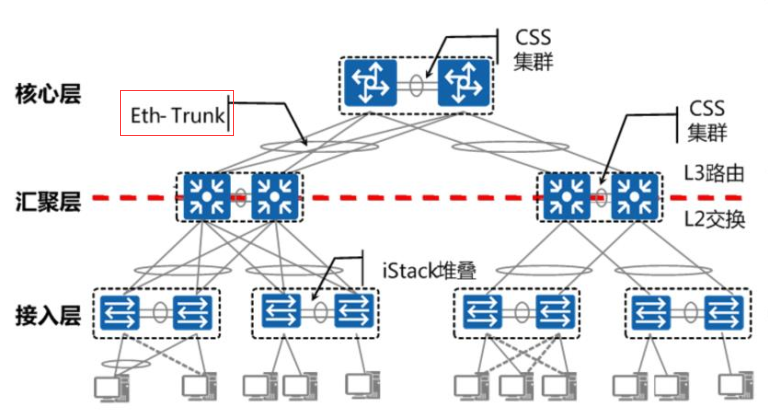
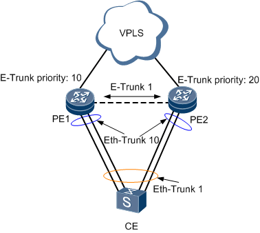
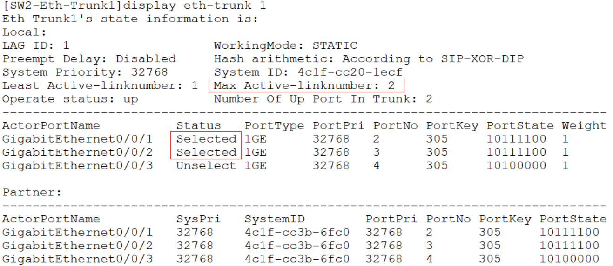

# **Eth-Trunk链路聚合** 

## Eth-Trunk：以太网链路聚合 

这是典型的大型园区网络组网之一：CSS+Eth-Trunk+iStack,主要特点是简单、高效、可靠。  

CSS:集群交换机系统（Cluster Switch System），框式交换机堆叠称为CSS  

iStack：智能堆叠（Intelligent Stack），盒式交换机堆叠称为iStack  

Eth-Trunk：以太网链路聚合 ：

​		**简单**：各层设备均使用堆叠技术，逻辑设备少，网络拓扑简单，二层天然没有环路，无需使用STP相关技术。  

​		**高效**：各层设备之间使用Eth-Trunk链路聚合技术，负载分担算法灵活，链路利用率高  

​		**可靠**：服务器和主机可以配置多NIC网卡Teaming负载均衡或主备冗余链路提高服务器接入可靠性  

​		堆叠技术同链路聚合技术结合使用，各层物理设备形成双归接入组网，提高整 网可靠性 

- **



- **e-trunk 是设备用的，可以将两个设备（如两台交换机）视为同一个东西。**

- **eth-trunk是接口用的，可以将两个端口（如ethernet0/0/1 和0/0/2）视为同一个接口**

  

以太网链路聚合Eth-Trunk简称链路聚合，通过将多个物理接口捆绑为一个逻辑接口,可以在不进行硬件升级的条件下，达到增加链路带宽的目的。  

链路聚合技术主要有以下三个优势：  

- **增加带宽**：链路聚合接口的最大带宽可以达到各成员接口带宽之和。  

- **提高可靠性**：当某条活动链路出现故障时，流量可以切换到其他可用的成员链路上，从而提高链路聚合接口的可靠性。  

- **负载分担**：在一个链路聚合组内，可以实现在各成员活动链路上的负载分担。

设备支持的链路聚合方式  :

- **同板**：是指链路聚合时，同一聚合组的成员接口分布在同一单板上。  

- **跨板**：是指链路聚合时，同一聚合组的成员接口分布在不同的单板上。  

- **跨框**：是指在集群场景下，成员接口分布在集群的各个成员设备上。

**跨设备：是指E-Trunk基于LACP进行了扩展，能够实现多台设备间的链路聚合。**

## **链路聚合模式**

**手工模式链路聚合**：手工模式下，Eth-Trunk的建立、成员接口的加入由手工配置，没  有链路聚合控制协议LACP的参与。该模式下所有活动链路都参与数据的转发，平均分担流  量。如果某条活动链路故障，链路聚合组自动在剩余的活动链路中平均分担流量。当需要在  两个直连设备之间提供一个较大的链路带宽，而其中一端或两端设备都不支持LACP协议时，可以配置手工模式链路聚合。  

**LACP模式链路聚合**：链路聚合控制协议LACP（Link Aggregation Control Protocol），是基于IEEE802.3ad标准的一种实现链路动态聚合与解聚合的协议，以供设备根据自身配置自动形成聚合链路并启动聚合链路收发数据，LACP模式就是采用LACP的一种链路聚合模式。聚合链路形成以后，LACP负责维护链路状态，在聚合条件发生变化时，自动调整链路聚合。LACP模式链路聚合由LACP确定聚合组中的活动和非活动链路，又称为  M:N模式，即M条活动链路与N条备份链路的模式。这种模式提供了更高的链路可靠性，并且可以在M条链路中实现不同方式的负载均衡。

**IEEE 802.3ad 是执行[链路聚合](https://baike.baidu.com/item/链路聚合/8626060)的标准方法。**

## 配置手工模式链路聚合

1. 创建聚合端口 

   ```
   [SW1]interface Eth-Trunk 1 
   ```

2. 配置为手动负载模式

   ```
   [SW1-Eth-Trunk1]mode manual load-balance
   ```

   

3. 将端口加入聚合端口

   ```
   [SW1-Eth-Trunk1]trunkport GigabitEthernet 0/0/1 to 0/0/3
   ```

   

4. 配置聚合端口为trunk端口

   ```
   [SW1-Eth-Trunk1]port link-type trunk 
   ```

   

5. 配置允许通过的VLAN列表

   ```
   [SW1-Eth-Trunk1]port trunk allow-pass vlan 2 3
   ```

   

## 配置LACP模式链路聚合：

1. 创建聚合端口  

   ```
   [SW1]interface Eth-Trunk 1  
   ```

2. 配置为LACP模式  

   ```
   [SW1-Eth-Trunk1]mode lacp-static  
   ```

   

3. 可选配置，配置最大活跃链路为2  

   ```
   [SW2-Eth-Trunk1]max active-linknumber 2  
   ```


**查看配置**：`display eth-trunk 1`



