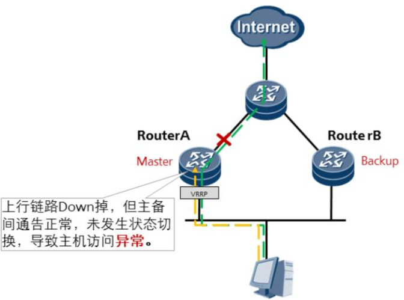

## VRRP工作方式

### 1、VRRP主备工作方式：

主备备份是VRRP提供备份功能的基本方式

#### Master设备的选举

​	VRRP根据优先级来确定虚拟路由器中每台设备的角色（Master设备或Backup设备）。优先级越高，则越有可能成为Master设备。

​	初始创建的VRRP设备工作在Initialize状态，收到接口Up的消息后，如果设备的优先级为255，则直接成为Master设备；

​	如果设备的优先级小于255，则会先切换至Backup状态， 待 Master_Down_Interval定时器超时后再切换至Master状态。

​	首先切换至Master状态的VRRP设备通过VRRP通告报文的交互获知虚拟设备中其他成员的优先级，进行Master的选举：

+ VRRP报文中Master设备的优先级高于或等于自己的优先 级，则Backup设备保持Backup状态。

+ 如果VRRP报文中Master设备的优先级低于自己的优先级，采 用抢占方式的Backup设备将切换至Master状态，采用非抢占方式 的Backup设备仍保持Backup状态。

+ 如果多个VRRP设备同时切换到Master状态，通过VRRP通告报文的交互进行协商后，优先级较低的VRRP设备将切换成Backup 状态，优先级最高的VRRP设备成为最终的Master设备；优先级相同时，VRRP设备上VRRP备份组所在接口主IP地址较大的成为Master设备。

+ 如果创建的VRRP设备为IP地址拥有者，收到接口Up的消息后，将会直接切换至Master状态。

#### Master设备状态的通告

+ 设备周期性地发送VRRP通告报文，在VRRP备份组中公布其配置信息（优先级等） 和工作状况。Backup设备通过接收到VRRP报文的情况来判断Master设备是否工作正常。当Master设备主动放弃Master地位（如Master设备退出备份组）时，会发送优先级为0的通告报文，用来使Backup设备快速切换成Master设备，而不用等到Master_Down_Interval定时器超时。这个切换的时间称为Skew time，计算方式为：（256－ Backup设备的优先级）/256，单位为秒。
+ 当Master设备发生网络故障而不能发送通告报文的时候， Backup设备并不能立即知道其工作状况。等到Master_Down_Interval定时器超时后，才会认为Master设备无法正常工作，从而将状态切换为Master。其中，Master_Down_Interval定时器取值为：**3×Advertisement_Interval＋Skew_time**，单位为秒。

#### Master故障或恢复后的切换过程

##### 	如果Master设备故障，则主备切换的过程：

​	

​	

#####  	如果Master故障恢复，则主备回切的过程：

​	

##### VRRP联动功能

​	当连接上行链路的接口Down时，Master设备通过降低自身的优先级，使得Backup设备抢占成为Master，承担转发任务。

### 2、VRRP负载分担工作方式

​	负载分担方式是指多台设备同时承担业务，负载分担方式需要建立多个VRRP备份组， 各备份组的Master设备可以不同。同一台VRRP设备可以加入多个备份组，在不同的备份组中具有不同的优先级。

