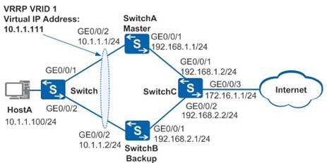

# VRRP配置

VRRP的配置比较简单，基本都是在接口下进行配置，如果是交换机，在vlanif接口配置即可：



配置过程：

1、首先需要配置路由可达

2、 启动VRRP组：

```
[AR1-GigabitEthernet0/0/0]vrrp vrid 1 virtual-ip 10.1.1.111

[AR2-GigabitEthernet0/0/0]vrrp vrid 1 virtual-ip 10.1.1.111
```

3、 配置优先级

```
[AR2-GigabitEthernet0/0/0]vrrp vrid 1 priority 150
```

4、 配置和直连上行接口联动

```
[AR2-GigabitEthernet0/0/0]vrrp vrid 1 track interface GigabitEthernet 0/0/1
```

5、 查看VRRP配置结果：

```
[AR2]display vrrp brief

[AR2]display vrrp

  GigabitEthernet0/0/0 | Virtual Router 1

​    State : Master

​    Virtual IP : 10.1.1.111

​    Master IP : 10.1.1.2

​    PriorityRun : 150

​    PriorityConfig : 150

​    MasterPriority : 150

​    Preempt : YES   Delay Time : 0 s

​    TimerRun : 1 s

​    TimerConfig : 1 s

​    Auth type : NONE

​    Virtual MAC : 0000-5e00-0101

​    Check TTL : YES

​    Config type : normal-vrrp

​    Backup-forward : disabled

​    Track IF : GigabitEthernet0/0/1   Priority reduced : 10

​    IF state : UP

​    Create time : 2019-04-23 17:06:29 UTC-08:00

​    Last change time : 2019-04-23 17:07:24 UTC-08:00
```

