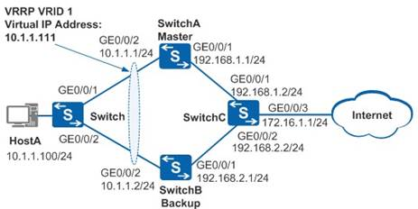

实验拓扑：

要求：

1） 配置switchA为VRRP master路由器,配置switchB为backup路由器

2） 配置switchB的优先级大于switchA,看看是否可以切换master路由器

3） 将switchB的上行接口g0/0/1接口shutdown，查看主机hostA是否能够和虚拟IP地址通信？是否可以和switchC的地址通信？如果不能通信，如何解决这个问题？

4） 把实验关键步骤命令列出，进行提交

  

