## eNSP安装

### eNSP介绍

​	eNSP是图形化网络仿真平台，该平台通过对真实网络设备的仿真模拟，帮助广大ICT（信息和通信技术）从业者和客户快速熟悉华为数通系列产品，了解并掌握相关产品的操作和配置、提升对企业ICT网络的规划、建设、运维能力，从而帮助企业构建更高效，更优质的企业ICT网络。

### eNSP安装前注意事项

​	eNSP 的使用依赖 WinPcap， Wireshark 和 VirtualBox 的支持，安装 eNSP 之前先到相应软件的官网上下载安装包进行安装。VirtualBox 支持 v4.2.x - v5.2.x 版本。

​	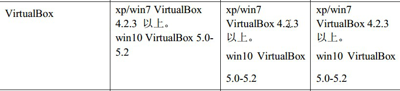

### eNSP依赖软件介绍

#### 1. winpcap

+ winpcap(windows packet capture)是windows平台下一个免费，公共的网络访问系统。开发winpcap这个项目的目的在于为win32应用程序提供访问网络底层的能力。它用于windows系统下的直接的网络编程。

#### 2. Wireshark

+ Wireshark（前称Ethereal）是一个网络封包分析软件。网络封包分析软件的功能是撷取网络封包，并尽可能显示出最为详细的网络封包资料。Wireshark使用WinPCAP作为接口，直接与网卡进行数据报文交换。

#### 3. VirtualBox 

+ VirtualBox 是一款开源虚拟机软件。VirtualBox 是由德国 Innotek 公司开发，由Sun Microsystems公司出品的软件，使用[Qt](https://baike.baidu.com/item/Qt)编写，在 Sun 被 [Oracle](https://baike.baidu.com/item/Oracle) 收购后正式更名成 Oracle VM VirtualBox。Innotek 以 GNU General Public License (GPL) 释出 VirtualBox，并提供二进制版本及 OSE 版本的代码。使用者可以在VirtualBox上安装并且执行Solaris、Windows、DOS、Linux、OS/2 Warp、BSD等系统作为客户端操作系统。现在则由[甲骨文公司](https://baike.baidu.com/item/%E7%94%B2%E9%AA%A8%E6%96%87%E5%85%AC%E5%8F%B8/430115)进行开发，是甲骨文公司xVM虚拟化平台技术的一部份。

### 开始安装eNSP

​	当我们安装完上述的三款软件，则可以正式安装eNSP了，在安装之前我们可以访 问 论 坛 获 取 一 些 技 术 支 持 ： [https://forum.huawei.com/enterprise/zh/forum-753.html ](https://forum.huawei.com/enterprise/zh/forum-753.html)

最新版eNSP v1.3.00.100下载地址：[https://support.huawei.com/enterprise/zh/tool/ensp-TL1000000015/23917110  ](https://support.huawei.com/enterprise/zh/tool/ensp-TL1000000015/23917110)

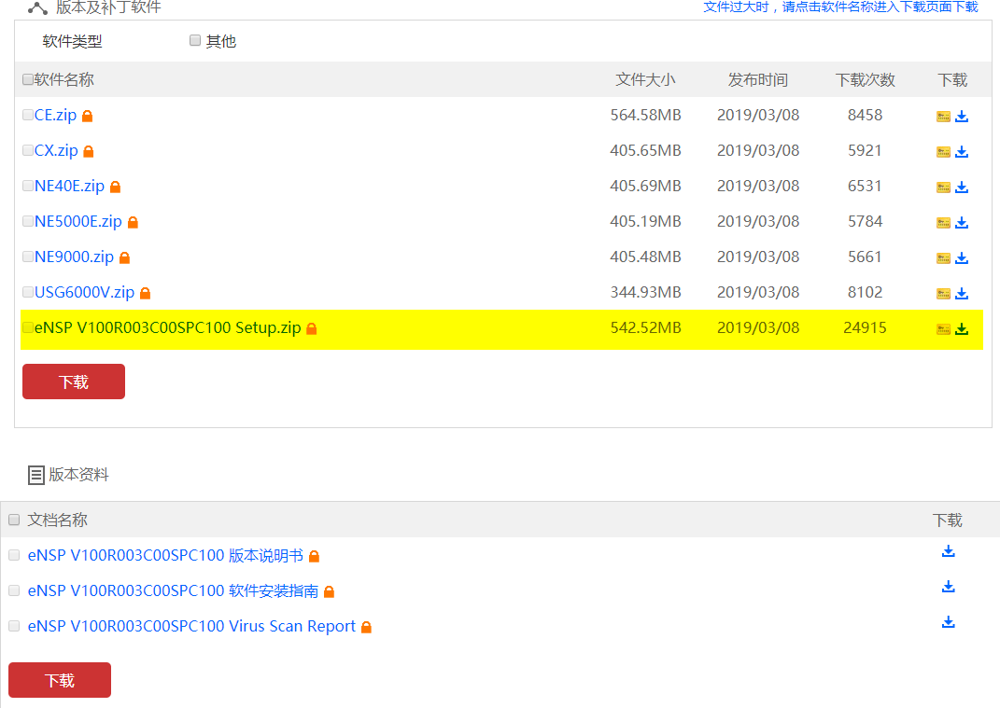

#### 安装步骤：

#### 1、双击安装程序文件，打开安装向导。选择“中文（简体） ”，并单击“确定”，进入欢迎界面

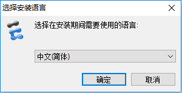

#### 2、单击“下一步（N）”

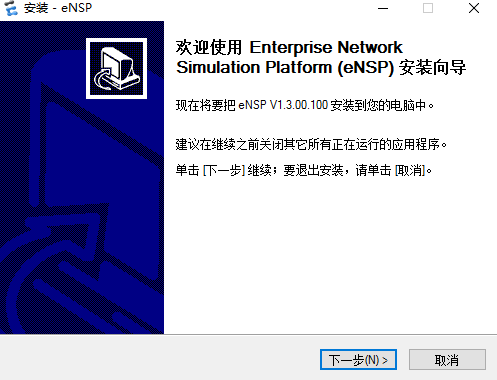

#### 3、同意许可协议

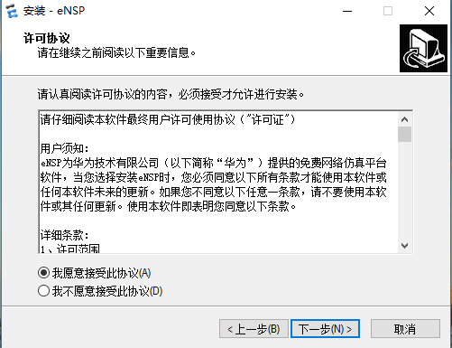

#### 4、设置安装的目录，单击“下一步（N） ”。

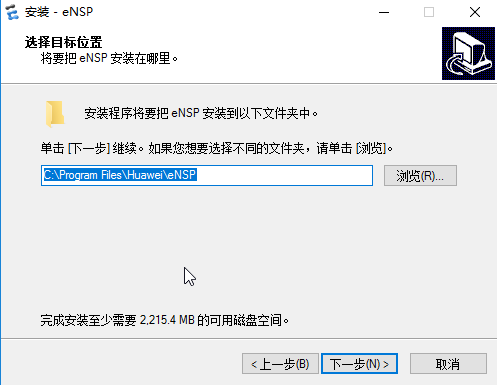

#### 5、设置eNSP在开始菜单中显示的名称，单击“下一步（N） ”。

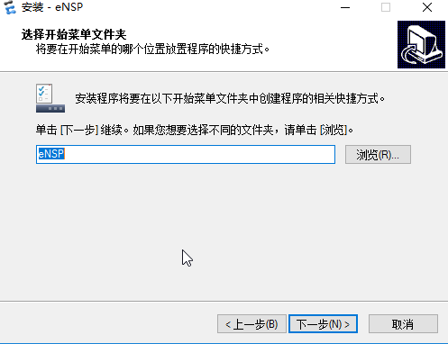

#### 6、选择是否要在桌面创建快捷方式，单击“下一步（N） ”。

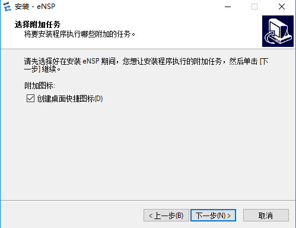

#### 7、检测依赖软件是否正常安装。

​	如果您已安装该三款软件，那么单击“下一步（N） ”继续。如果您有任何一款依赖软件没有安装，则您无法继续进行安装，需要退出。安装 eNSP，先安装该三款软件。

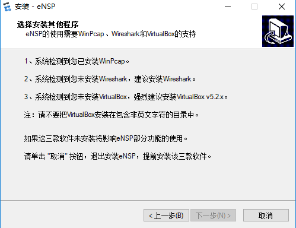

#### 8、确认安装信息后，单击“安装（I） ”开始安装。

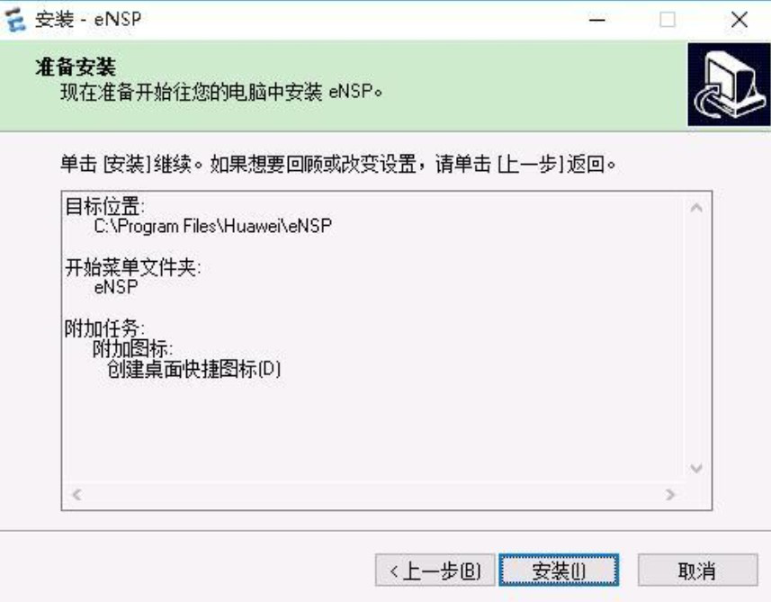

#### 9、安装完成后，若不希望立刻打开程序，可不选择“运行 eNSP”。单击“完成（F）”结束安装。

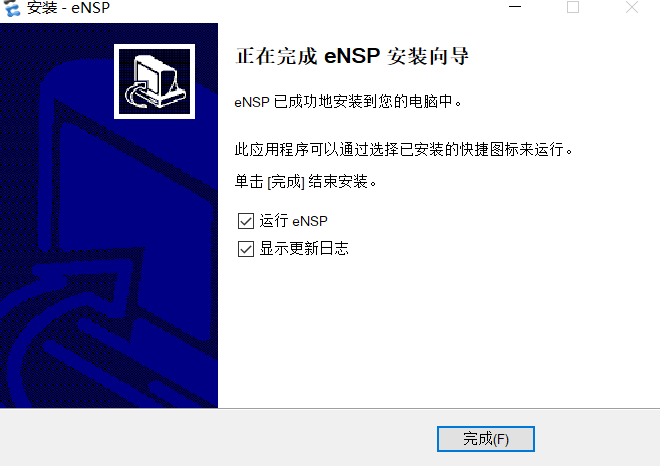

#### 10、打开eNSP软件后界面如下：

 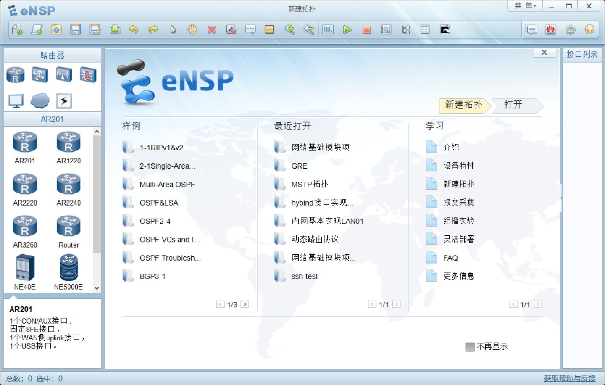