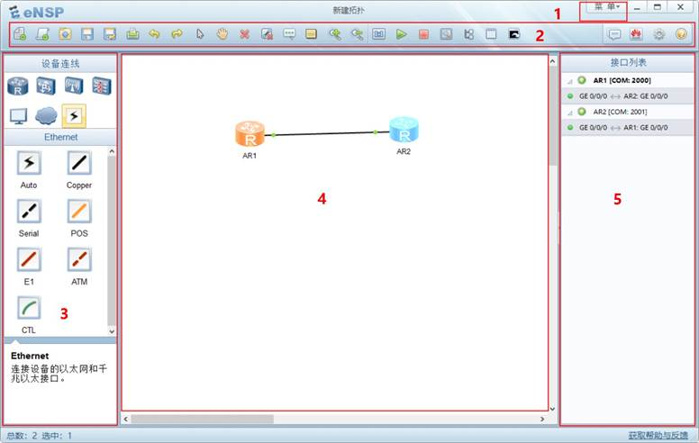
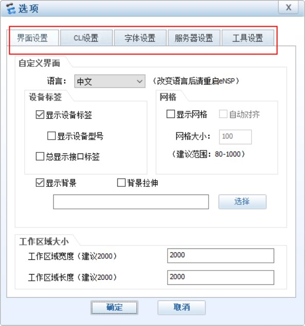
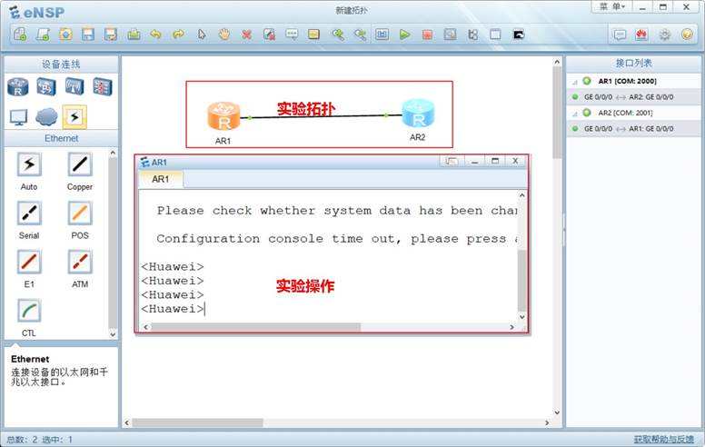
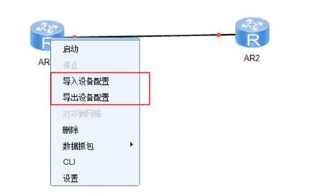

# eNSP基本使用

## 一、打开eNSP，界面如图所示，大致可分为5块区域：

1、        主菜单：提供“文件”、“编辑”、“视图”、“工具”、“考试”、“帮助”菜单。

2、        工具栏：主要是提供了一些功能的快捷访问工具。

3、        网络设备区：此区域分为上中下三部分，上部：设备类别区；中部：设备型号区；下部：简介。

4、        工作区：工作区为空白区域，可以根据需要从左侧的设备区拉取设备。

5、        设备接口区：此区域显示拓扑中的设备和设备已连接的接口。

## 二、打开选项界面：

1、界面设置：设置语言、背景、工作区大小等调整

2、CLI设置：命令行界面的一些设置

3、字体设置：设置命令行字体颜色等以及文字字体颜色等

4、服务器设置：设置本地服务器地址和端口以及远程服务器地址（分布式配置）

5、工具设置：设置内存保护、自动更新以及工具引用

## 三、基本操作包含以下：

1、创建拓扑并开始试验

2、导入/导出实验配置 需要先在设备中使用save命令保存配置，然后便可以导出配置；设备在停止状态，还可以做配置的导入：

