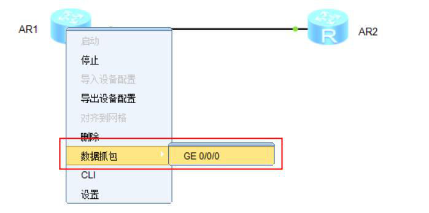
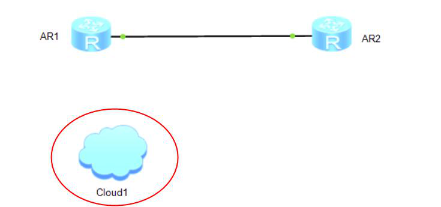
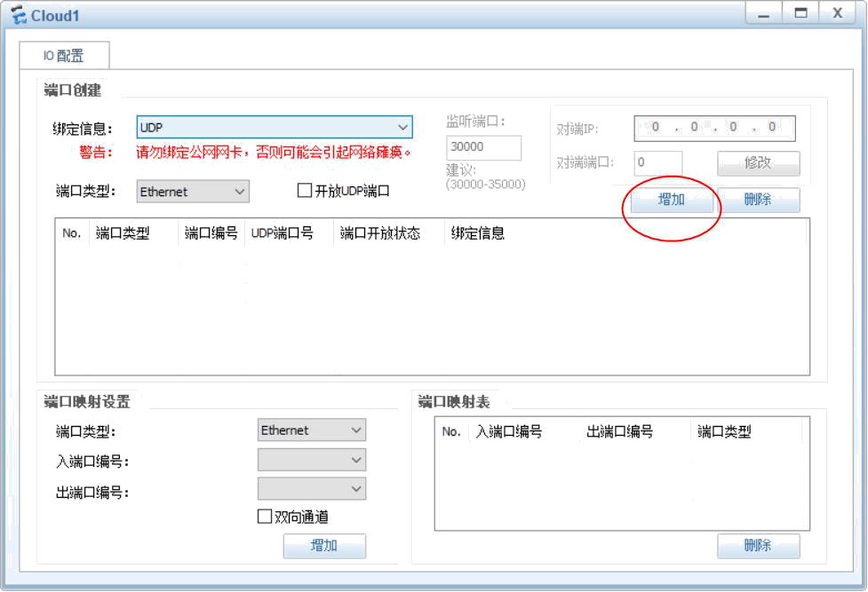
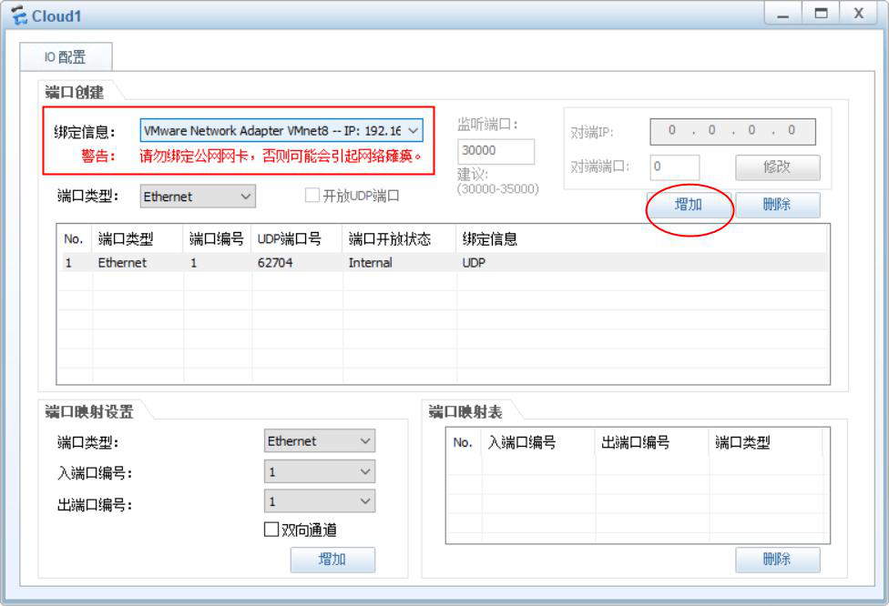
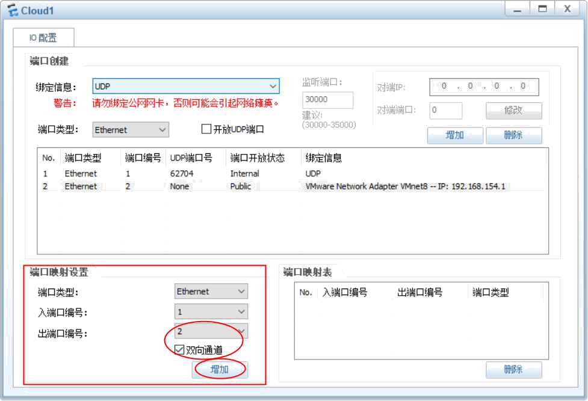
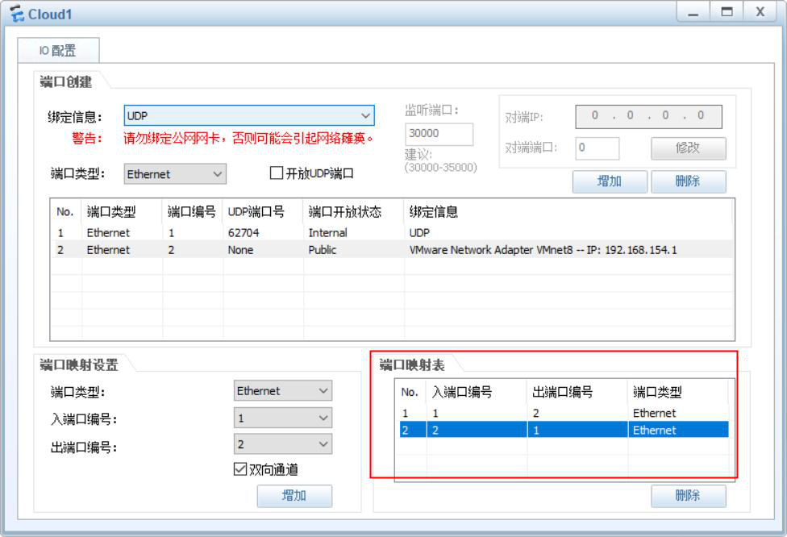

# eNSP高级使用

## 一、抓取eNSP中设备之间通信的报文

想要抓取报文，需要安装wireshark抓包工具

## 二、在eNSP中桥接VMware虚拟机

**以下所有VMware8网卡在实际环境中为Virtual Host-Only Network #2网卡**

1. 拖拽一个cloud设备到工作区

   

2. 打开cloud设置界面，点击增加

   

3. 在绑定信息位置，选择需要桥接的VMware网卡，这里选择VMware8网卡，然后点击增加

   

4. 在端口映射设置中，把出端口编号改为2，勾选双向通道，点击增加

   

5. 端口映射表如下，然后关闭这个设置界面

   

6. 将设备和cloud进行连接，这样设备的端口就和VMware8网卡进行桥接了

   

